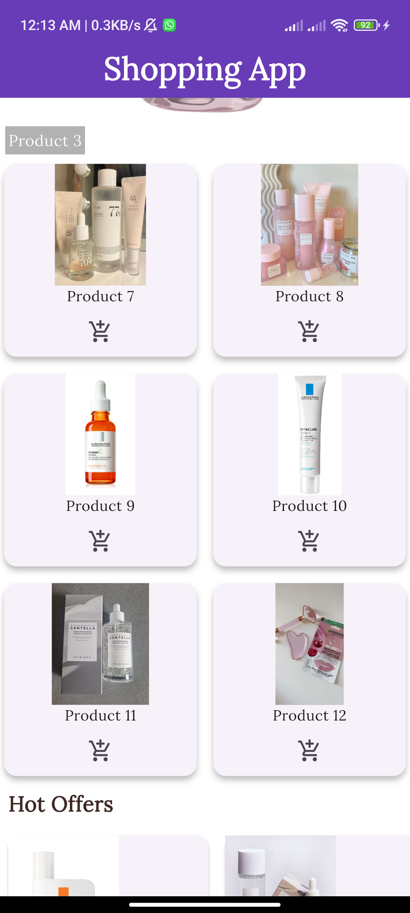
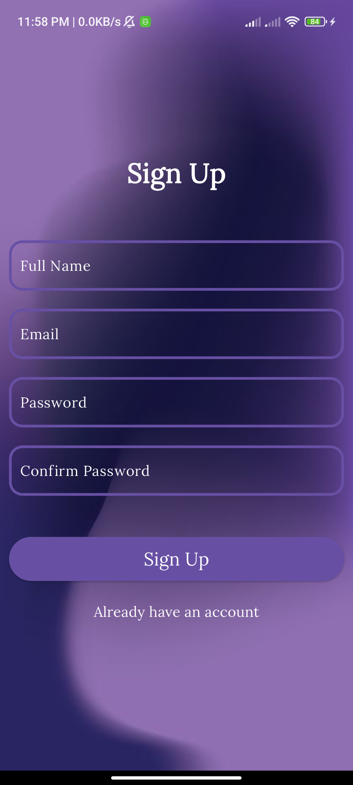
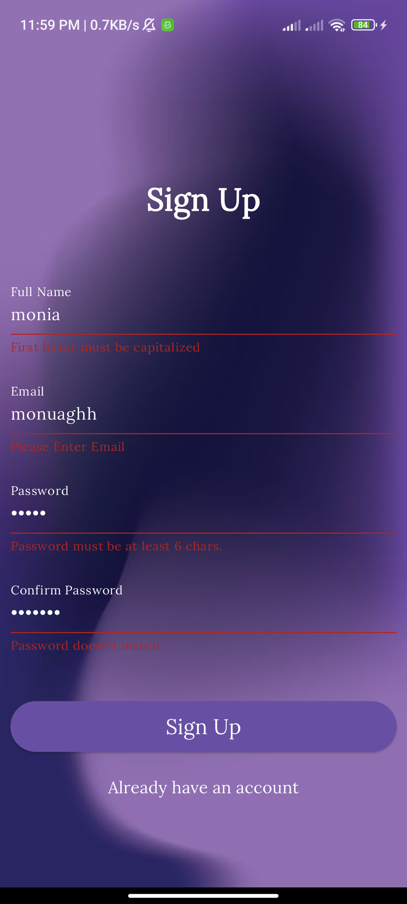
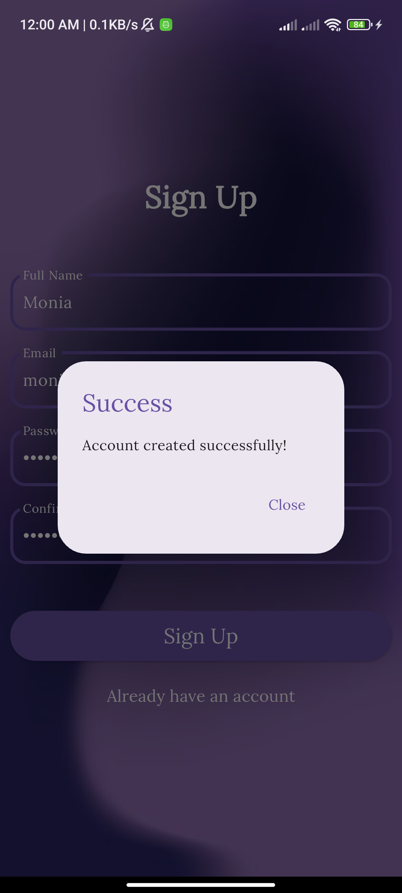

# Shopping App

A Flutter application that delivers a simple shopping App. In the app, one will have a product page
view, grid-based product displays, and a section for hot offers.

---

## Features

- **Product Page View**: A swipe-able featured products `PageView`.
- **Product Grid**: Here is a grid with products.
- **Hot Offers Section**: A list of offers in horizontal scroll view.
- **Add to Cart**: Add items to cart with feedback which show using `SnackBar`.
- **Responsive Design**: Optimized for various screen sizes.
- **Sign Up Screen**: A validation-enabled sign-up form to register users and navigate them to the
  shopping screen.
- **Custom Fonts and Assets**: Integrated with local assets for images and custom fonts for enhanced
  UI.

---

### Screenshots

| **Feature**    | **Screenshot**                |
|----------------|-------------------------------|
| **Product**    |         |
| **Hot Offers** |     |
| **Grid**       |              |
| **SignUp**     |          |
| **Validation** |  |
| **Dialog**     |          |

---

## Folder Structure

```plaintext
shopping_app/
├── lib/
│   ├── main.dart                  # Main entry point of the app
│   ├── screens/
│   │   ├── shopping_screen.dart   # Main shopping screen
│   │   ├── signup_screen.dart     # Sign up screen with validation
│   │   ├── product_page_view.dart # PageView for featured products
│   │   ├── product_grid.dart      # Grid layout for product display
│   │   ├── hot_offer_list.dart    # Horizontal list for hot offers
│   ├── widgets/
│   │   ├── custom_text_form_field.dart # Custom text field widget
├── assets/
│   ├── images/
│   │   ├── main_back.jpg          # Background image for the Sign Up screen
│   │   ├── product1.jpg           # Local image used in the app
│   │   └── product2.jpg
│   └── fonts/
│       └── Lora-Regular.ttf       # Custom font file
├── pubspec.yaml                   # Dependencies and assets configuration
├── README.md                      # Project documentation
├── output.png                     # Screenshot of the app
├── output1.png
├── output2.png
├── signup.png                     # Screenshot of the Sign Up screen
├── validation.png                     # Screenshot of validation
├── dialog.png                     # Screenshot of dialog
   

```

## How to Run

1. Install and setup Flutter in your system.
2. Clone the repository and open the folder in your IDE or text editor.
3. Then, Run

```bash
flutter pub get
flutter run

```

## **Sign Up Screen Functionality**

The **Sign Up Screen** includes a form with the following fields:

1. **Full Name**: Validates that the first letter is capitalized.
2. **Email**: Validates the presence of "@" and ensures proper email formatting.
3. **Password**: Ensures a minimum of 6 characters.
4. **Confirm Password**: Validates that it matches the password.

---

### **Features**

- **Successful Validation**:
    - A dialog is displayed with the message **"Account created successfully"**.
    - Upon closing the dialog, the user is redirected to the shopping screen.

- **Failed Validation**:
    - A **SnackBar** appears with an appropriate error message, specifying the issue (e.g., invalid
      email, mismatched passwords, etc.).

---

### **Widgets Used**

- **CustomTextFormField**:
    - A reusable widget for text form fields.
    - Includes configurable properties like:
        - `label`: Field label text.
        - `validation`: Custom validation logic.
        - `inputType`: Specifies the type of input (text, email, password, etc.).
        - `obscureText`: Hides the input for password fields.
        - `controller`: Manages the state of the input field.

---

### **Code Explanation**

- **Validation Logic**: Each field has a corresponding validator to check the input against specific
  rules (e.g., password length, email format).
- **Dialog and SnackBar**:
    - **Dialog**: Shown on successful validation with a button to navigate to the shopping screen.
    - **SnackBar**: Appears with an error message if validation fails.
- **Navigation**: On successful account creation, the user is navigated to the **ShoppingScreen**
  using the `Navigator.push` method.

---