# Shopping App

A Flutter application that delivers a simple shopping App. In the app with Firebase Authentication
for user registration, login, and logout, one will have a product page
view, grid-based product displays, and a section for hot offers.
The app supports Arabic and English languages using Flutter's localization features

---

## Features

- **Product Page View**: A swipe-able featured products `PageView`.
- **Product Grid**: Here is a grid with products.
- **Hot Offers Section**: A list of offers in horizontal scroll view.
- **Add to Cart**: Add items to cart with feedback which show using `SnackBar`.
- **Responsive Design**: Optimized for various screen sizes.
- **Sign Up Screen**: A validation-enabled sign-up form to register users and navigate them to the
  shopping screen.
- **Custom Fonts and Assets**: Integrated with local assets for images and custom fonts for enhanced
  UI.
- **Fade-In Animation**: Smoothly introduces the `ShoppingScreen` using a `fade-in` effect.
- **Reusable Components**: Created widgets like `CustomTextFormField` for scalable and modular
  development.
- **Localization**: Supports both `Arabic` and `English` languages.
- **Firebase Authentication**: Used for **sign up**, **login**, and **logout** functionality.
- **State Management**: Uses Cubit for managing the app's state, including **language changes**.

---

### Screenshots

| **Feature**           | **Screenshot**                                          |
|-----------------------|---------------------------------------------------------|
| **login**             | 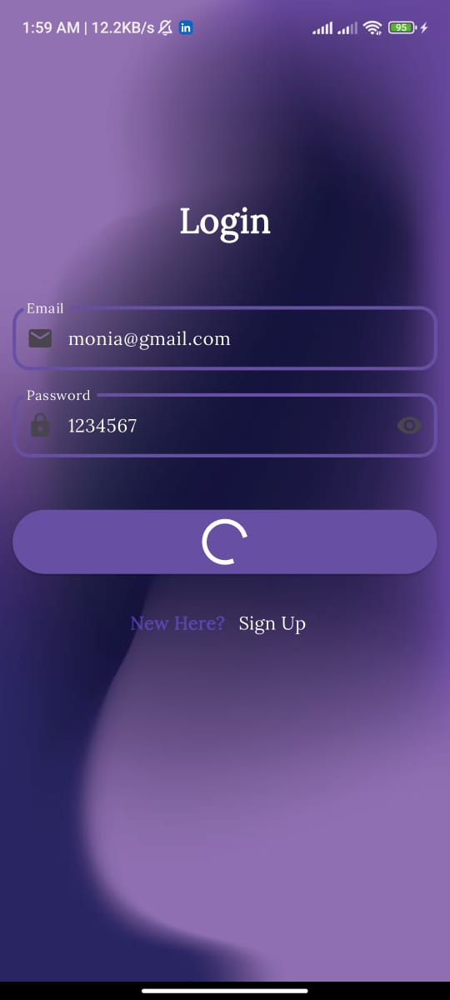                        |
| **logout**            | 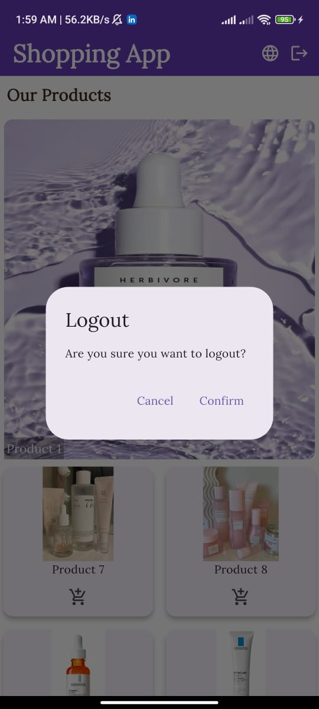                      |
| **loginSuccess**      |          |
| **signUpFirebase**    | 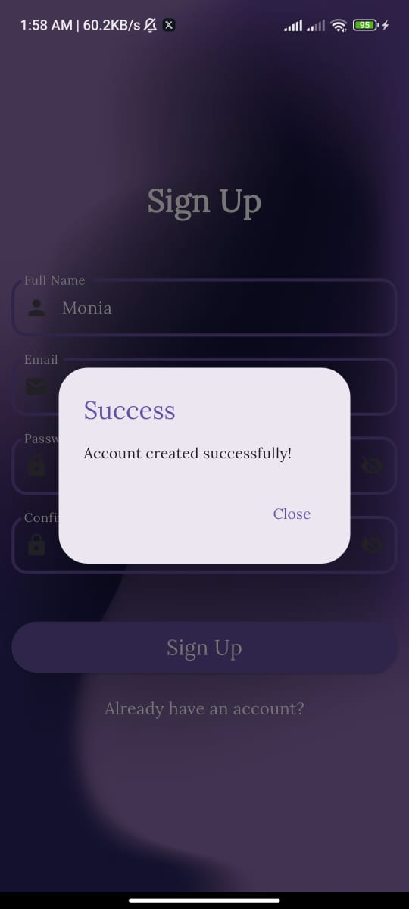     |
| **Product**           |                       |
| **Hot Offers**        | 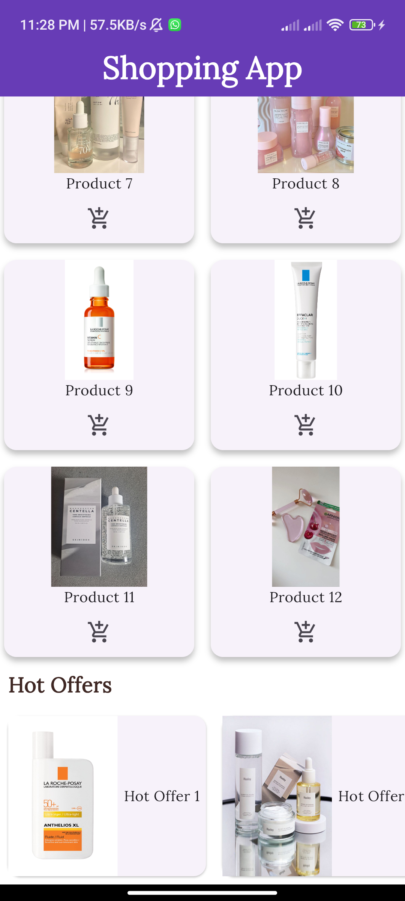                  |
| **Grid**              | 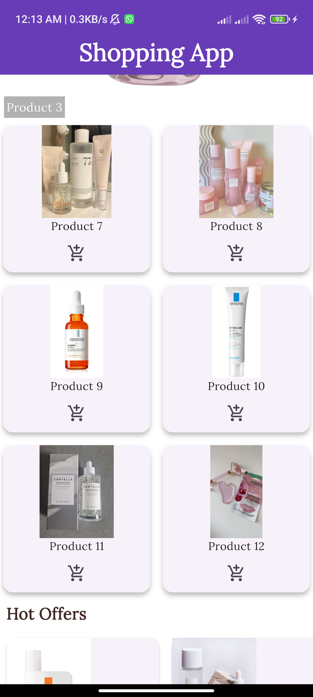                           |
| **SignUp**            | 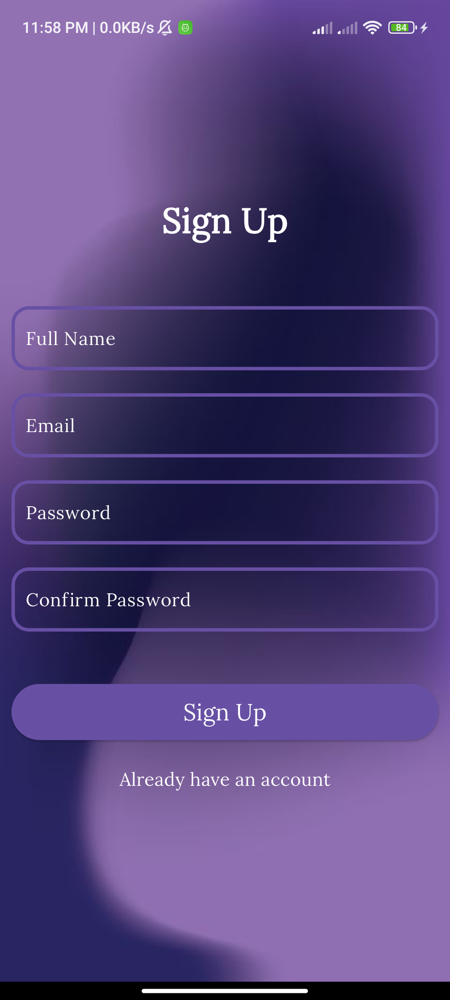                       |
| **Validation**        | 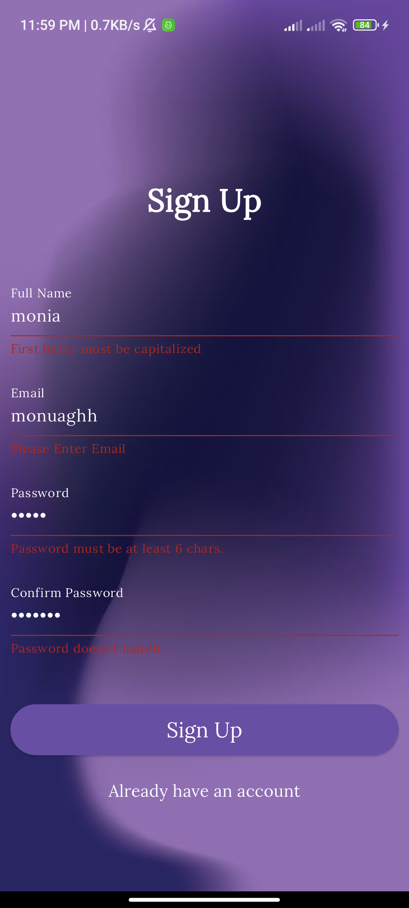               |
| **Dialog**            | 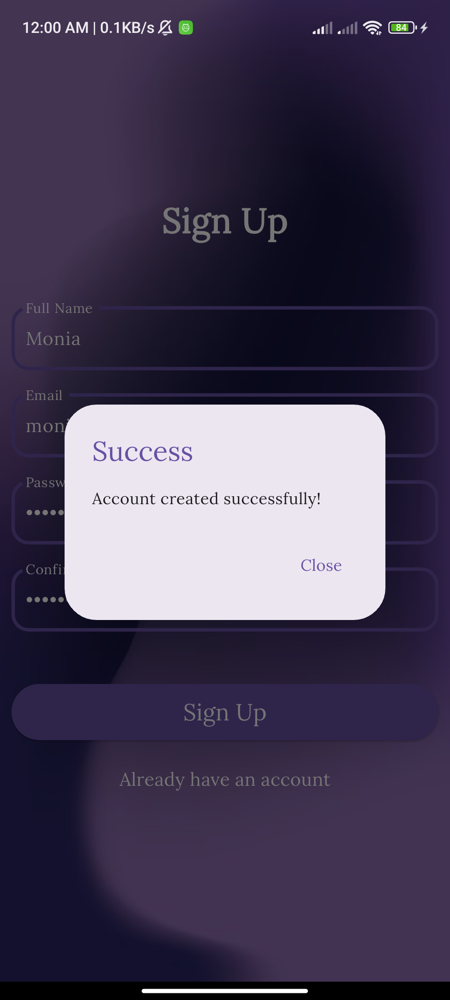                       |
| **arabic_dialog**     | 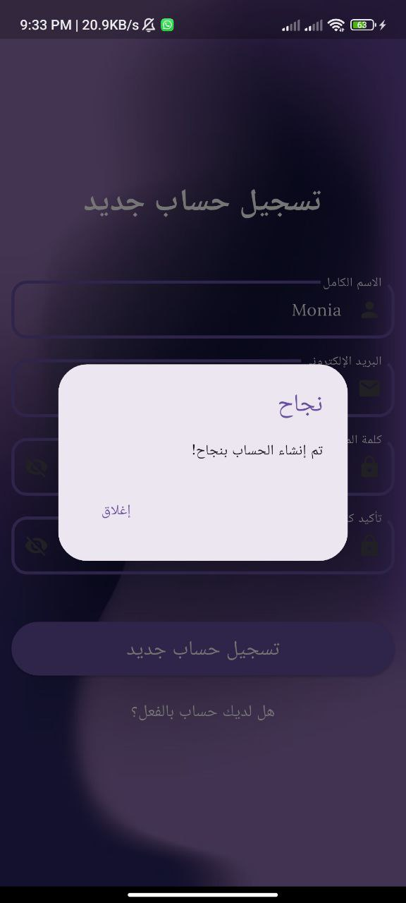         |
| **arabic_home**       |              |
| **arabic_validation** | 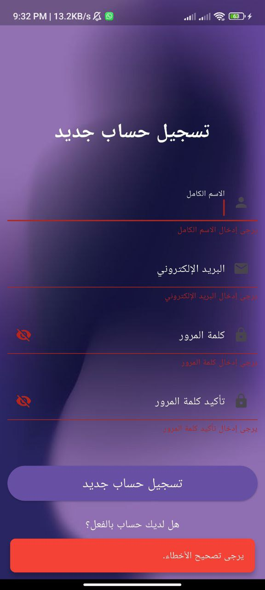 |
| **arabic_signup**     | 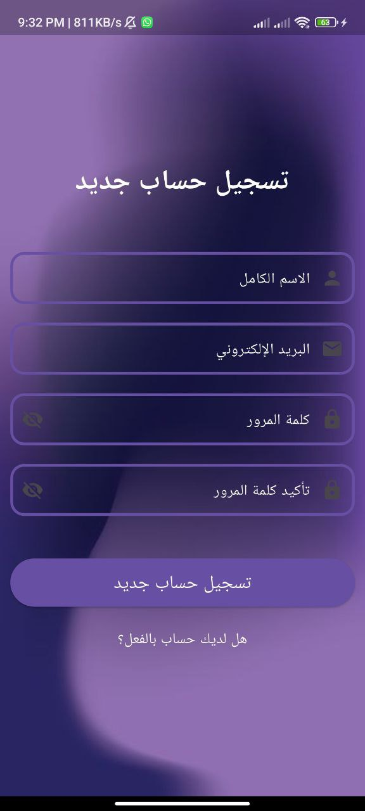         |
| **icon**              |                            |
| **offer**             | 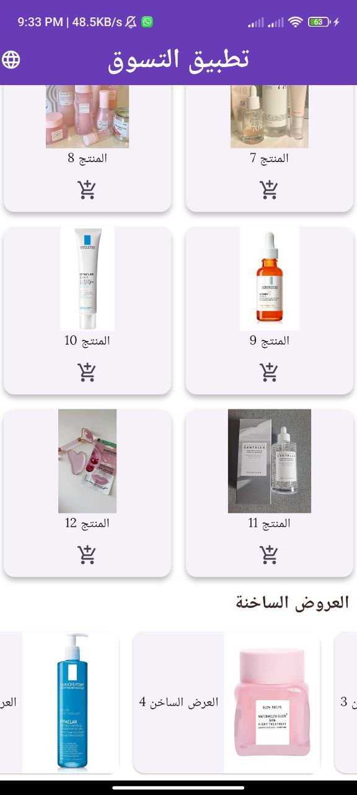                         |
| **product**           | 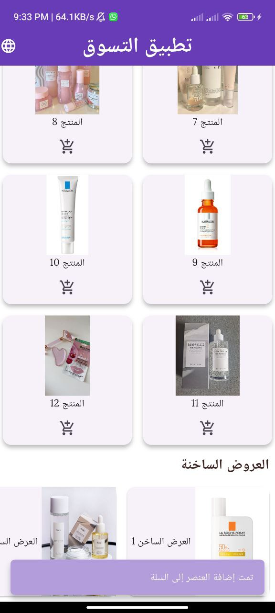                     |

---

## Folder Structure

```plaintext
shopping_app/
├── lib/
│   ├── main.dart                  # Main entry point of the app
│   ├── l10n/                  # Localization files
│   ├── app_en.arb         # English translations
│   └── app_ar.arb         # Arabic translations
│   ├── screens/
│   │   ├── shopping_screen.dart   # Main shopping screen
│   │   ├── signup_screen.dart     # Sign up screen with validation
│   │   └── login_screen.dart
│   ├── widgets/
│   │   ├── custom_text_form_field.dart # Custom text field widget
│   │   ├── product_page_view.dart # PageView for featured products
│   │   ├── product_grid.dart      # Grid layout for product display
│   │   └── hot_offer_list.dart    # Horizontal list for hot offers
│   ├── cubits/
│   │   ├── changeLanguageCubit.dart # Cubit for language changes
│   │   └── changeLanguageState.dart # State for language changes 
├── assets/
│   ├── images/
│   │   ├── main_back.jpg          # Background image for the Sign Up screen
│   │   ├── product1.jpg           # Local image used in the app
│   │   └── product2.jpg
│   └── fonts/
│       └── Lora-Regular.ttf       # Custom font file
├── pubspec.yaml                   # Dependencies and assets configuration
├── README.md                      # Project documentation
├── output.png                     # Screenshot of the app
├── output1.png
├── output2.png
├── signup.png                     # Screenshot of the Sign Up screen
├── validation.png                     # Screenshot of validation
├── dialog.png                     # Screenshot of dialog

```

## How to Run

1. Install and setup Flutter in your system.
2. Clone the repository and open the folder in your IDE or text editor.
3. Then, Run

```bash
flutter pub get
flutter run

```

### Firebase Authentication

The app uses Firebase Authentication for:

- **Sign Up**: Users can create an account using email and password.
- **Login**: Users can log in using their registered email and password.
- **Logout**: Users can log out from their accounts.

---

### Sign Up Screen

- **Full Name**: Validates that the first letter is capitalized.
- **Email**: Validates the presence of "@" and ensures proper email formatting.
- **Password**: Ensures a minimum of 6 characters.
- **Confirm Password**: Validates that it matches the password.

#### Validation:

- **Success**: A dialog is displayed with the message "Account created successfully", and the user
  is redirected to the shopping screen.
- **Failure**: A SnackBar appears with an appropriate error message (e.g., invalid email, mismatched
  passwords).

---

### Login Screen

- **Login**: Users can log in using their email and password.
- **Firebase Authentication Errors**: Handles errors such as wrong password or user not found,
  showing an appropriate error message.

---

### Logout Functionality

- **Logout**: Users can log out from their accounts, which redirects them to the login screen.

---

### Localization and Language Management

#### Localization Setup

- The app uses **flutter_localizations** and **Cubit** to manage localization and language changes.

##### Translation Files:

- **Located in the `l10n` folder**:
    - `app_en.arb` (English translations)
    - `app_ar.arb` (Arabic translations)

#### Cubit for Locale Management:

- The **ChangeLanguageCubit** manages the app's current locale and notifies the UI when the language
  changes.

#### Change Language:

- Users can switch between Arabic and English using a language toggle button.

---

### State Management

The app uses **Cubit** for state management:

- **ChangeLanguageCubit**: Manages the app's locale and language changes.

---

### Animations

#### Fade-In Animation

- The **ShoppingScreen** uses a **fade-in animation** when navigating from the **Sign Up** or *
  *Login** screens.
- Achieved using `AnimatedOpacity` with a delay of 500 milliseconds.

#### Dialog Animation

- Success and error dialogs use smooth fade-in transitions for a better user experience.

---

## Dependencies

The app uses the following packages:

- **[firebase_core](https://pub.dev/packages/firebase_core)**: For Firebase integration.
- **[firebase_auth](https://pub.dev/packages/firebase_auth)**: For authentication.
- **[flutter_localizations](https://pub.dev/packages/flutter_localizations)**: For localization.
- **[flutter_bloc](https://pub.dev/packages/flutter_bloc)**: For state management using Cubit.
- **[intl](https://pub.dev/packages/intl)**: For internationalization support.

---