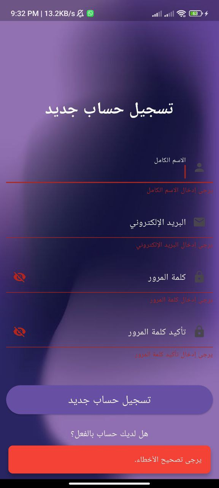
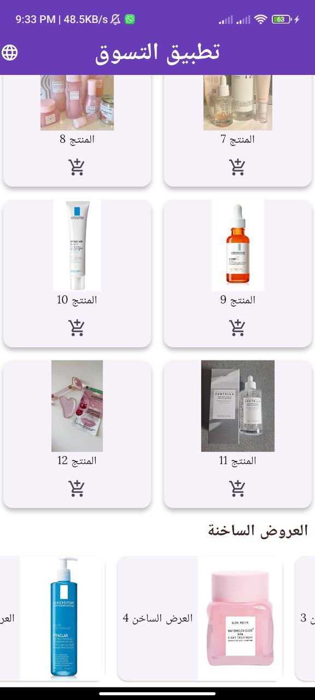

# Shopping App

A Flutter application that delivers a simple shopping App. In the app, one will have a product page
view, grid-based product displays, and a section for hot offers.
The app supports Arabic and English languages using Flutter's localization features

---

## Features

- **Product Page View**: A swipe-able featured products `PageView`.
- **Product Grid**: Here is a grid with products.
- **Hot Offers Section**: A list of offers in horizontal scroll view.
- **Add to Cart**: Add items to cart with feedback which show using `SnackBar`.
- **Responsive Design**: Optimized for various screen sizes.
- **Sign Up Screen**: A validation-enabled sign-up form to register users and navigate them to the
  shopping screen.
- **Custom Fonts and Assets**: Integrated with local assets for images and custom fonts for enhanced
  UI.
- **Fade-In Animation**: Smoothly introduces the `ShoppingScreen` using a `fade-in` effect.
- **Reusable Components**: Created widgets like `CustomTextFormField` for scalable and modular
  development.
- **Localization**: Supports both `Arabic` and `English` languages.

---

### Screenshots

| **Feature**           | **Screenshot**                              |
|-----------------------|---------------------------------------------|
| **Product**           |                       |
| **Hot Offers**        |                   |
| **Grid**              |                            |
| **SignUp**            |                        |
| **Validation**        |                |
| **Dialog**            |                        |
| **arabic_dialog**     |          |
| **arabic_home**       |              |
| **arabic_validation** |  |
| **arabic_signup**     |          |
| **icon**              |                            |
| **offer**             |                          |
| **product**           |                      |

---

## Folder Structure

```plaintext
shopping_app/
├── lib/
│   ├── main.dart                  # Main entry point of the app
│   ├── l10n/                  # Localization files
│   ├── app_en.arb         # English translations
│   └── app_ar.arb         # Arabic translations
│   ├── screens/
│   │   ├── shopping_screen.dart   # Main shopping screen
│   │   ├── signup_screen.dart     # Sign up screen with validation
│   │   
│   ├── widgets/
│   │   ├── custom_text_form_field.dart # Custom text field widget
│   │   ├── product_page_view.dart # PageView for featured products
│   │   ├── product_grid.dart      # Grid layout for product display
│   │   ├── hot_offer_list.dart    # Horizontal list for hot offers
├── assets/
│   ├── images/
│   │   ├── main_back.jpg          # Background image for the Sign Up screen
│   │   ├── product1.jpg           # Local image used in the app
│   │   └── product2.jpg
│   └── fonts/
│       └── Lora-Regular.ttf       # Custom font file
├── pubspec.yaml                   # Dependencies and assets configuration
├── README.md                      # Project documentation
├── output.png                     # Screenshot of the app
├── output1.png
├── output2.png
├── signup.png                     # Screenshot of the Sign Up screen
├── validation.png                     # Screenshot of validation
├── dialog.png                     # Screenshot of dialog

```

## How to Run

1. Install and setup Flutter in your system.
2. Clone the repository and open the folder in your IDE or text editor.
3. Then, Run

```bash
flutter pub get
flutter run

```

## **Sign Up Screen Functionality**

The **Sign Up Screen** includes a form with the following fields:

1. **Full Name**: Validates that the first letter is capitalized.
2. **Email**: Validates the presence of "@" and ensures proper email formatting.
3. **Password**: Ensures a minimum of 6 characters.
4. **Confirm Password**: Validates that it matches the password.

---

### **Features**

- **Successful Validation**:
    - A dialog is displayed with the message **"Account created successfully"**.
    - Upon closing the dialog, the user is redirected to the shopping screen.

- **Failed Validation**:
    - A **SnackBar** appears with an appropriate error message, specifying the issue (e.g., invalid
      email, mismatched passwords, etc.).

- **Password Toggle Visibility**:
    - Password fields include an **Eye Icon** to toggle visibility between plain text and obscured
      text.

---

### **Widgets Used**

- **CustomTextFormField**:
    - A reusable widget for text form fields.
    - Includes configurable properties like:
        - `label`: Field label text.
        - `validation`: Custom validation logic.
        - `inputType`: Specifies the type of input (text, email, password, etc.).
        - `obscureText`: Hides the input for password fields.
        - `controller`: Manages the state of the input field.

---

### **Code Explanation**

- **Validation Logic**: Each field has a corresponding validator to check the input against specific
  rules (e.g., password length, email format).
- **Dialog and SnackBar**:
    - **Dialog**: Shown on successful validation with a button to navigate to the shopping screen.
    - **SnackBar**: Appears with an error message if validation fails.
- **Navigation**: On successful account creation, the user is navigated to the **ShoppingScreen**
  using the `Navigator.push` method.

---

### **Animations**

The **Sign Up Screen** and **Shopping Screen** incorporate several animations to enhance the user
experience:

- **Fade-in Animation for Shopping Screen**:
    - The **Shopping Screen** initially appears with a **fade-in** effect after a delay of 500
      milliseconds when navigating from the Sign-Up screen. This makes the transition smooth and
      visually appealing.
    - The opacity of the screen changes from `0.0` to `1.0` over 1 second, providing a smooth visual
      experience as the shopping content loads.

- **AnimatedSwitcher for Screen Transition**:
    - When the user successfully signs up, an **AnimatedSwitcher** is used to switch between the *
      *Sign Up Screen** and the **Shopping Screen**.
    - This creates a seamless transition between screens with a fade-in effect for the shopping
      screen.

- **AnimatedOpacity for Form Elements**:
    - On the **Sign Up Screen**, the form elements, such as input fields and buttons, are wrapped
      with an **AnimatedOpacity** widget, providing a fade-in effect when the form is loaded.

- **Dialog Animation**:
    - When the user successfully validates the form, an **AlertDialog** appears with a smooth
      fade-in transition, providing clear feedback for account creation success.
    - Upon closing the dialog, the app fades out the current screen before navigating to the
      shopping screen.

---

### **Animation Code Explanation**

- **Fade-in**: The `AnimatedOpacity` widget is used to animate the opacity of the `ShoppingScreen`
  and other UI elements, giving them a smooth transition.
- **AnimatedSwitcher**: This widget allows for smooth transitions between different screens,
  particularly useful when switching between the **Sign Up Screen** and **Shopping Screen**.

### **New Features Added**

#### **Fade-In Animation**

- A **fade-in** effect has been introduced for the **ShoppingScreen** to ensure a smooth entry when
  transitioning from the **Sign Up Screen**.
- This is achieved using the `AnimatedOpacity` widget, which allows for a simple and responsive
  transition.
- The opacity of the screen starts at 0.0 and gradually transitions to 1.0 with a delay of **300
  milliseconds**, providing a sleek visual effect for the screen's appearance.

### **Localization Setup**

1. Add Localization Files The app uses Flutter's `flutter_localizations` package to support multiple
   languages.
2. The translation files are located in the `l10n` folder:
   `app_ar.arb` (Arabic)
   `app_en.arb` (English)